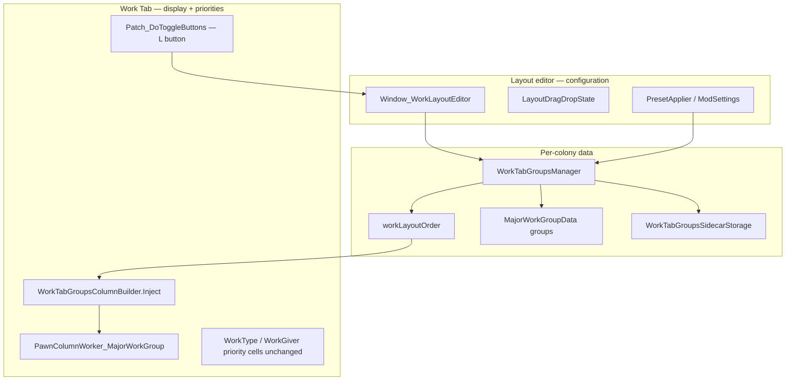

# Work Tab Groups — development reference

RimWorld mod that extends **Fluffy's Work Tab** with custom collapsible work groups. Layout editing happens in a dedicated window; the Work Tab displays the configured column order and handles pawn priorities only.

---

## Mod packaging

| Path | Role |
|------|------|
| [`About/About.xml`](About/About.xml) | RimWorld 1.5 / 1.6; packageId `philip2p2026.worktabgroups` |
| [`LoadFolders.xml`](LoadFolders.xml) | Version-specific assemblies under `1.5/` and `1.6/` |
| **Dependencies** | Harmony (`brrainz.harmony`), **Work Tab** (`Fluffy.WorkTab`) — hard requirement |
| [`Languages/English/Keyed/WorkTabGroups.xml`](Languages/English/Keyed/WorkTabGroups.xml) | UI strings |
| `1.5/Assemblies/WorkTabGroups.dll`, `1.6/Assemblies/WorkTabGroups.dll` | Built output (build targets 1.6, copies to 1.5) |
| **No `Defs/`** | Custom group columns are implied defs generated at runtime |

---

## Glossary

| Term | Meaning |
|------|---------|
| **Work type** (`WorkTypeDef`) | Native Work Tab section (Cooking, Construction, …). Fixed in vanilla order; appears as a row in the layout editor. |
| **WorkGiver** (`WorkGiverDef`) | Single job column under a work type (e.g. `DoBillsCook`). Can be moved into a custom group via the layout editor. |
| **Custom group** (`MajorWorkGroupData`) | Player-defined bucket with its own column header and assigned WorkGivers. Draggable among work types in the layout editor. |
| **Layout order** (`workLayoutOrder`) | Per-colony ordered list of `WorkLayoutEntry` items (`WorkType` or `CustomGroup`). Drives Work Tab column injection. |
| **Sidecar** | Per-save XML at `SaveData/WorkTabGroups/{saveName}.xml` — groups + layout order, separate from the main `.rws`. |
| **Layout preset** | Global mod-settings snapshot of full layout (order + groups + WorkGiver assignments). |
| **Group preset** | Global mod-settings snapshot of one group's label and WorkGiver list. |
| **Anchor** (`insertAfterAnchor`) | **Legacy** position field (`WorkType:Firefight`, or empty = start). Used only to migrate old saves/presets into `workLayoutOrder`. No longer written. |

---

## Architecture



**Layout changes** → `WorkTabGroupsManager.RequestColumnRelayout()` (or `RequestColumnRebuild()` when groups are added/removed).

**Work Tab interaction policy:** no layout editing in the Work Tab. Group headers support Ctrl+click expand/collapse and Shift+scroll bulk priority only. WorkGiver headers are not patched for assign/reorder.

---

## Data model

### `WorkLayoutEntry` (`Source/Data/WorkLayoutEntry.cs`)

| Field | Values |
|-------|--------|
| `kind` | `WorkType` or `CustomGroup` |
| `key` | `WorkTypeDef.defName` or group `defName` (e.g. `MajorWorkGroup_0`) |

### `MajorWorkGroupData` (`Source/Data/MajorWorkGroupData.cs`)

| Field | Purpose |
|-------|---------|
| `defName` | Stable id (`MajorWorkGroup_{n}`) |
| `label` | Player-visible group name |
| `assignedWorkGiverDefNames` | Ordered WorkGiver def names in this group |
| `expanded` | Whether grouped WorkGiver columns are visible in the Work Tab |
| `insertAfterAnchor` | Legacy migration only; not written on new saves |

### `WorkTabGroupsManager` (`GameComponent`)

Singleton via `Instance` / `EnsureRegistered()`.

| Method | Purpose |
|--------|---------|
| `EnsureWorkLayoutOrder()` | Build default order, migrate from anchors, or sync new work types from mods |
| `CreateGroup(label, layoutIndex)` | Add group + insert into `workLayoutOrder` |
| `DeleteGroup(defName)` | Remove group and its layout entry |
| `MoveLayoutEntry(from, to)` | Reorder a custom group in `workLayoutOrder` |
| `AssignWorkGiver` / `AssignWorkGiverAt` | Move WorkGiver into group (optional index) |
| `UnassignWorkGiver` | Return WorkGiver to native work type section |
| `MoveWorkGiverWithinGroup` | Reorder `assignedWorkGiverDefNames` |
| `ReplaceGroupsFromPreset(groups, layoutOrder)` | Apply layout preset |
| `CaptureLayoutPreset` / `CaptureGroupPreset` | Serialize to mod settings |
| `PrepareForModRemoval()` | Unassign all WorkGivers, clear groups, rebuild vanilla columns, delete sidecar, remove component |

### Persistence

| Store | Location | Contents |
|-------|----------|----------|
| **Sidecar** | `SaveData/WorkTabGroups/{save}.xml` | `groups`, `workLayoutOrder`, `nextGroupId` |
| **Mod settings** | RimWorld mod options XML | `layoutPresets`, `groupPresets`, `defaultLayoutPresetName` |
| **Game component** | `WorkTabGroupsManager.ExposeData` | Same fields (sidecar is authoritative on load) |

On save, `Patch_Game_ExposeData` strips the manager from the main save XML; `WorkTabGroupsSidecarStorage` writes the sidecar.

On load, if the in-memory manager has no groups, the sidecar is applied via `ApplyPersistedState` (after `LayoutSanitizer.PruneLayoutData` on deserialized sidecar data).

### Mod-removal resilience

| Concern | Handling |
|---------|----------|
| **Other mod removes WorkGivers** | `Patch_WorkPriority_ExposeData` silently skips missing defs in Work Tab pawn priority XML. `LayoutSanitizer` prunes missing/invalid WorkGivers from custom groups and removes empty groups. |
| **Other mod removes WorkTypes** | `LayoutSanitizer` + `LayoutOrderUtility.SyncWorkTypesInLayoutOrder` drop missing work types from `workLayoutOrder`. |
| **Disabling Work Tab Groups** | Layout lives in sidecar (not `.rws`); implied group columns are runtime-only. `PrepareForModRemoval()` unassigns WorkGivers, restores vanilla column layout, deletes sidecar. Loading without Prepare is usually safe; Prepare + save is recommended. |
| **Invalid WorkGiver mapping** | `LayoutSanitizer` removes assigned names when the def, its `workType`, or the `WorkTypeDef` is missing. |

`LayoutSanitizer` runs in `RebuildRuntimeState`, before column injection, on sidecar load, and in `PrepareForModRemoval`.

### Migration

When `workLayoutOrder` is empty but `groups` exist (old anchor-based save):

`LayoutOrderMigration.MigrateFromAnchors()` reconstructs order from `insertAfterAnchor` + `groups` list order.

Old layout presets without `layoutOrder` use the same migration in `PresetApplier.ApplyLayout`.

---

## Column injection

`WorkTabGroupsColumnBuilder.Inject()` (called after every Work Tab column rebuild):

1. Capture native WorkType expand state.
2. Collect WorkGiver columns assigned to custom groups.
3. Copy non-work columns from the vanilla layout (skip WorkType / WorkGiver / group columns).
4. Walk `manager.WorkLayoutOrder`:
   - **WorkType** → WorkType header + unassigned WorkGivers (vanilla `priorityInType` order).
   - **CustomGroup** → group header + assigned WorkGiver columns (list order).
5. Wire `WorkGiverGroupLinks`, restore expand state, wire native WorkType parent links.

`WireExpandableColumns()` re-binds expand/collapse after partial relayout.

Implied defs per group: `MajorWorkGroupDef` + `PawnColumnDef_MajorWorkGroup` (created in `EnsureImpliedDefs`).

---

## Source layout

```
Source/
├── WorkTabGroupsMod.cs           # Mod entry, Harmony, slim settings UI
├── WorkTabGroupsSettings.cs      # Global presets + default layout
├── WorkTabGroupsManager.cs       # Colony state, layout order, group CRUD
├── WorkTabGroupsColumnBuilder.cs # Work Tab column injection
├── WorkTabGroupsSidecarStorage.cs
├── WorkTabGroupsSaveTracker.cs   # Tracks current save filename
├── LayoutOrderUtility.cs         # Default order, unassigned WorkGivers, sync
├── LayoutOrderMigration.cs       # Anchor → layout order migration
├── LayoutSanitizer.cs            # Prune missing WorkGivers/WorkTypes, empty groups
├── PresetApplier.cs
├── AnchorKeys.cs                 # Legacy anchor parsing (migration)
├── WorkGiverGroupLinks.cs        # WorkGiver → custom group worker map
├── PawnColumnWorker_MajorWorkGroup.cs
├── MajorWorkGroupPriorityUtility.cs
├── MajorWorkGroupDrawUtility.cs
├── CompactWorkTabCompat.cs
├── Data/
│   ├── MajorWorkGroupData.cs
│   ├── WorkLayoutEntry.cs
│   ├── PresetData.cs             # GroupPreset, LayoutPreset, LayoutGroupEntry
│   └── WorkTabGroupsSidecarData.cs
├── Defs/
│   ├── MajorWorkGroupDef.cs
│   └── PawnColumnDef_MajorWorkGroup.cs
├── Patches/
│   ├── Patch_ColumnRebuild.cs    # ReBuildWorkTabColumns, InitializeExpandableColumns
│   ├── Patch_ProcessWorkGiverColumns.cs
│   ├── Patch_DoToggleButtons.cs  # L button → layout editor
│   ├── Patch_WorkGiver_VisibleCurrently.cs
│   ├── Patch_WorkTab_Expand.cs
│   ├── Patch_PriorityTracker_WorkTypeScope.cs
│   ├── Patch_WorkPriority_ExposeData.cs  # Silent load when WorkGiver mod removed
│   ├── Patch_SaveLoadSidecar.cs
│   └── Patch_Game_ComponentRegistration.cs
└── UI/
    ├── Window_WorkLayoutEditor.cs
    ├── LayoutDragDropState.cs
    ├── Dialog_SavePreset.cs      # Save layout / group preset dialogs
    ├── Dialog_RenameMajorWorkGroup.cs
    └── Dialog_ApplyGroupPreset.cs
```

---

## Layout editor UI

Opened from Work Tab **L** button (`Patch_DoToggleButtons`) or referenced in mod settings copy.

| Action | Behavior |
|--------|----------|
| Add group | Name field + button; inserts after selected group or at end |
| Drag `≡` on group row | Reorder custom group in `workLayoutOrder` |
| Drag `≡` on WorkGiver | Assign to group, reorder within group, or unassign (drop outside group) |
| Expand work type / group | Toggle child WorkGiver list (editor-only expand for work types) |
| Save / load preset | `Dialog_SaveLayoutPreset`, float menu of `layoutPresets` |
| Rename / delete | Operates on selected custom group |

Native WorkGiver order under work types is **read-only** (vanilla `priorityInType`).

---

## Harmony patches

Harmony id: `philip2p2026.worktabgroups`.

| Patch | Target | Effect |
|-------|--------|--------|
| `Patch_ReBuildWorkTabColumns` | `DefGenerator_GenerateImpliedDefs_PreResolve.ReBuildWorkTabColumns` | Postfix → `ColumnBuilder.Inject()` |
| `Patch_InitializeExpandableColumns` | `InitializeExpandableColumns` | Postfix → `WireExpandableColumns()` |
| `Patch_ProcessWorkGiverColumns` | `ProcessWorkGiverColumns` | Keep custom group columns across Work Tab rebuilds |
| `Patch_DoToggleButtons` | `MainTabWindow_WorkTab.DoToggleButtons` | **L** button opens layout editor |
| `Patch_WorkGiver_VisibleCurrently` | `PawnColumnWorker_WorkGiver.VisibleCurrently` | Grouped WorkGivers follow parent group expand state |
| `Patch_WorkTab_Expand` | `MainTabWindow_WorkTab.Expand` | Allow collapse when `CanExpand` is false |
| `Patch_PriorityTracker_*` | `PriorityTracker` WorkType scope | WorkType bulk priority skips WorkGivers in custom groups |
| `Patch_WorkPriority_ExposeData` | `WorkPriority.ExposeData` | Load WorkGiver def names via `GetNamedSilentFail` (no error spam when other mods removed) |
| `Patch_Game_*` / `Patch_GameDataSaveLoader_*` | Game lifecycle, save/load | Component registration, sidecar I/O, strip manager from main save |
| `Patch_Game_ExposeData` | `Game.ExposeData` | Sidecar persistence hook |

---

## Build

```bash
cd Source
dotnet build WorkTabGroups.csproj -c Release
```

- Output: `1.6/Assemblies/WorkTabGroups.dll`
- Post-build copies to `1.5/Assemblies/`
- References: `Assembly-CSharp`, Unity modules, `0Harmony`, `WorkTab` (local Steam paths in `.csproj`)

---

## Mod settings (global)

| Setting | Purpose |
|---------|---------|
| `layoutPresets` | Saved full layouts |
| `groupPresets` | Saved single-group templates |
| `defaultLayoutPresetName` | Auto-applied on new game when no groups exist |

Colony-specific editing is done in-game via the layout editor, not mod settings.

---

## Downstream integration

**Work Monitor** (`philip2p2026.workmonitor`) loads after this mod and reads custom groups via `WorkTabGroupsProvider` for extra monitor rows. Changing group `defName` or sidecar shape may affect that integration.

---

## When changing this mod

1. **Layout changes** must update `workLayoutOrder` and call `RequestColumnRelayout` / `RequestColumnRebuild`.
2. **New WorkTypes from other mods** are merged by `LayoutOrderUtility.SyncWorkTypesInLayoutOrder` — verify column builder still finds the WorkType column def.
3. **Do not reintroduce Work Tab layout interactions** (right-click assign, header reorder) unless explicitly requested — configuration belongs in `Window_WorkLayoutEditor`.
4. **Preserve sidecar migration** when touching `MajorWorkGroupData` or preset formats.
5. **Player-facing copy:** use **work type** and **custom group**; avoid ambiguous “group” when meaning `WorkTypeDef`.
